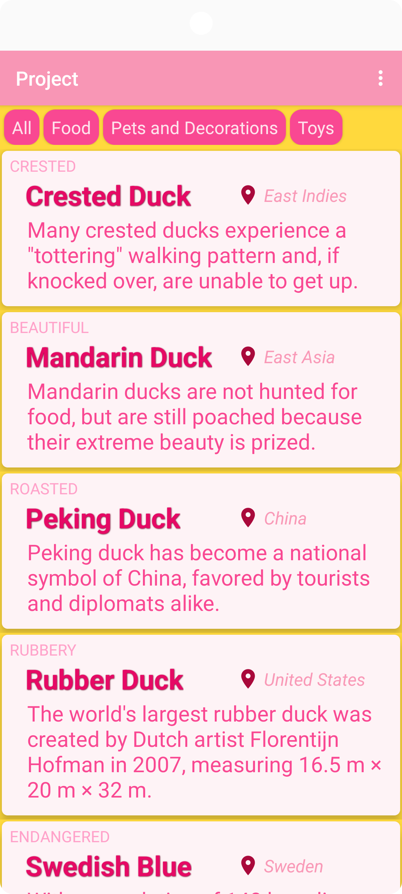
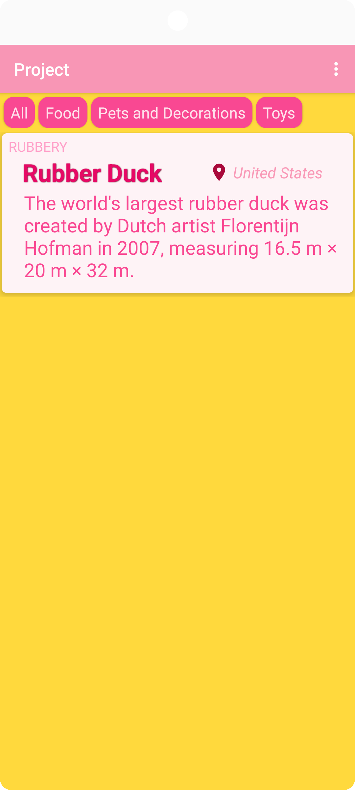
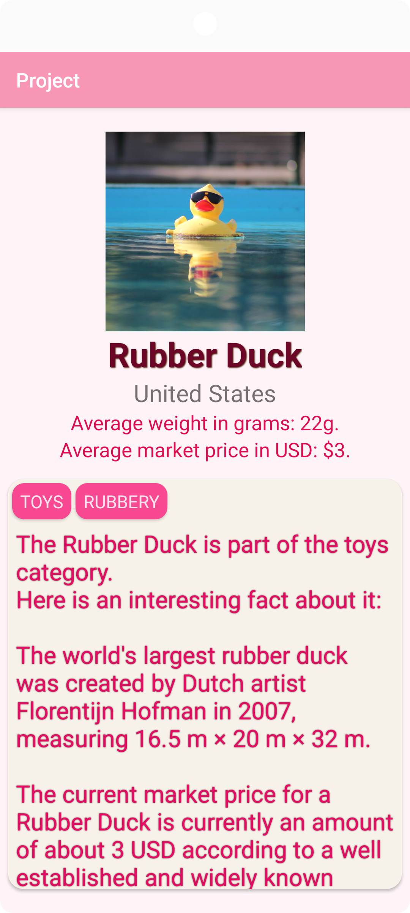
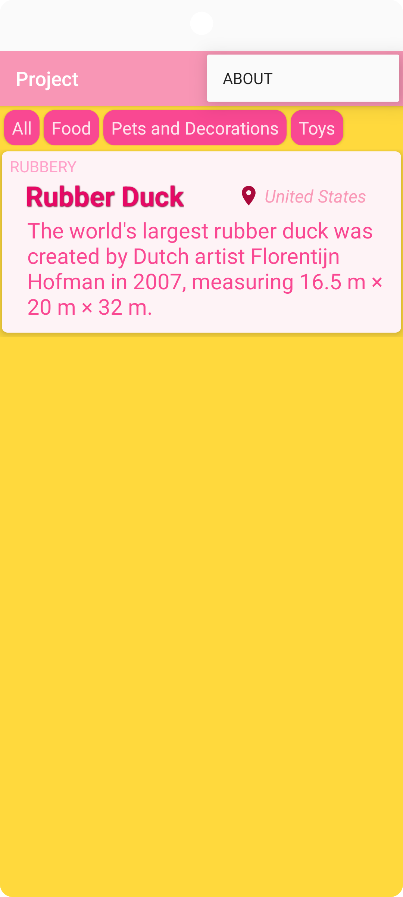
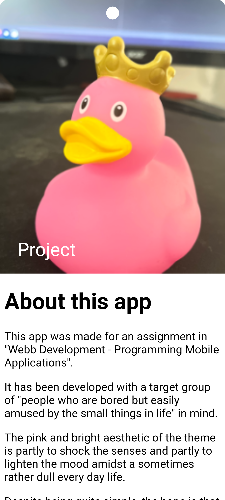
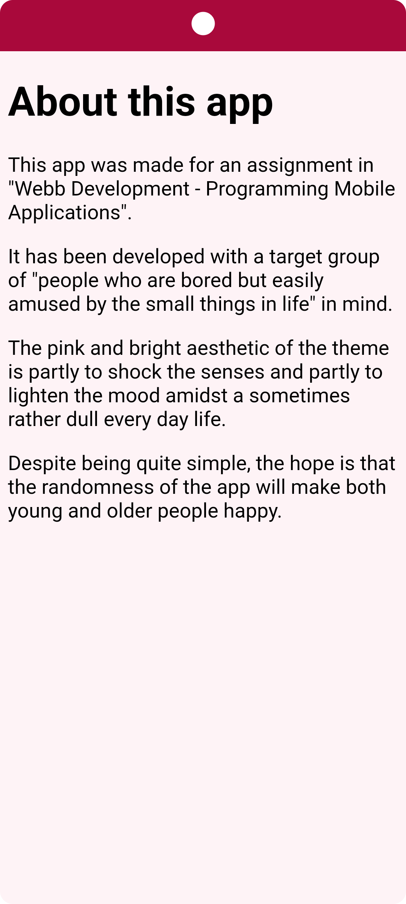

# Rapport

**Assignment: Project**

Results:

Initial launch:

Using a filter:

After clicking on an item (separate activity):

On main, clicking options menu in toolbar:

On ABOUT screen (separate activity):

Scrolling down in about screen, menu collapsed:

